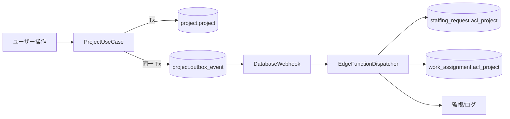

# 05. 同期機構の PoC 設計（冪等性・監視方針）

> 1 本の上流イベント（**案件名変更**）が、下流の ACL に追従する流れを実装可能な粒度で描く。PoC の目的は「同期方式を 1 つ通して見え方を固め、冪等性と監視の抜けを炙り出す」こと。

## PoC のスコープ

| 項目 | 内容 |
|------|------|
| 上流イベント | `project.project.name` の変更 |
| 影響する ACL | `staffing_request.acl_project.name`, `work_assignment.acl_project.name` |
| 起点 | ユースケース「案件名を変更する」 |
| 範囲 | 同期実装・冪等性・遅延時の挙動・監視の 4 点 |

PoC の外（将来検討）: 上流の物理削除、一括再投影、他の ACL 列。

## 同期方式の比較（再掲 + 選定）

| 方式 | 実装コスト | 鮮度 | 下流の結合 | 推奨 |
|------|-----------|------|-----------|------|
| A. アプリ同期（同一 Tx 内 UPSERT） | 低 | 即時 | 下流が上流を直接叩くので **高い結合** | 小規模・単一リポジトリのみ |
| B. イベント駆動（DB トリガ/RPC → Outbox → Webhook → Edge Function） | 中 | 秒〜分 | 結合は疎（Outbox 経由） | **本 PoC の採用** |
| C. バッチ再投影 | 低 | 時間〜日 | 疎 | B の補完として併用 |

### 採用: B + C

- **B（イベント駆動）** を本線とし、**C（日次バッチ）** でラグ超過や取りこぼしを救済する二層構成。
- B は **Outbox パターン** を使い、書き込み Tx の成功と同じ境界で確実にイベントを残す。

## アーキテクチャ



## 実装要素

### 1. Outbox テーブル（`project` スキーマ内）

```sql
CREATE TABLE project.outbox_event (
    id              UUID PRIMARY KEY DEFAULT extensions.gen_random_uuid(),
    aggregate_type  TEXT NOT NULL,          -- 'project'
    aggregate_id    UUID NOT NULL,          -- project.id
    event_type      TEXT NOT NULL,          -- 'project.name_changed'
    payload         JSONB NOT NULL,
    occurred_at     TIMESTAMPTZ NOT NULL DEFAULT now(),
    dispatched_at   TIMESTAMPTZ,            -- NULL なら未処理
    attempts        INT NOT NULL DEFAULT 0,
    last_error      TEXT
);

CREATE INDEX idx_outbox_pending
  ON project.outbox_event (occurred_at)
  WHERE dispatched_at IS NULL;
```

### 2. ユースケース（同一 Tx で書く）

```sql
BEGIN;

UPDATE project.project
SET name = $1, updated_at = now()
WHERE id = $2;

INSERT INTO project.outbox_event (aggregate_type, aggregate_id, event_type, payload)
VALUES (
    'project', $2, 'project.name_changed',
    jsonb_build_object('id', $2, 'name', $1, 'source_updated_at', now())
);

COMMIT;
```

### 3. ディスパッチャ（Supabase Edge Function、Webhook 起点）

疑似コード（TypeScript / Deno）:

```ts
const eventId = payload.record?.id ?? payload.new?.id;
const ev = await loadOutboxById(eventId);
if (!ev || ev.dispatched_at) return;

try {
  if (ev.event_type === 'project.upserted' || ev.event_type === 'project.resync') {
    await upsertAclProject('staffing_request', ev.payload);
    await upsertAclProject('work_assignment', ev.payload);
  }
  await markDispatched(ev.id);
} catch (e) {
  await recordFailure(ev.id, e);
}
```

### 4. 冪等性の担保

- `upsertAclProject` は `ON CONFLICT (project_id) DO UPDATE SET ... WHERE excluded.source_updated_at > acl_project.source_updated_at`。
- 同じイベントが二度流れても、`source_updated_at` の比較で **古い更新は無視**される。
- Outbox 側も `attempts` を持ち、`dispatched_at` がセットされるまで再試行する。
- Webhook の到達失敗に備え、補助的に `dispatched_at IS NULL` をスキャンするフォールバック関数を定期実行する。

### 5. 日次バッチ（救済層）

1 日 1 回、次の SQL で差分を検出して再投影:

```sql
-- 鮮度ズレのある ACL を抽出して再同期キューに積む
INSERT INTO project.outbox_event (aggregate_type, aggregate_id, event_type, payload)
SELECT 'project', p.id, 'project.resync',
       jsonb_build_object('id', p.id, 'name', p.name, 'source_updated_at', p.updated_at)
FROM project.project p
LEFT JOIN staffing_request.acl_project a ON a.project_id = p.id
WHERE a.project_id IS NULL
   OR a.source_updated_at IS NULL
   OR a.source_updated_at < p.updated_at;
```

## 冪等性・競合のテスト観点

| シナリオ | 期待される結果 |
|----------|---------------|
| 同じ `project.upserted` を 2 回流す | ACL は 1 回目の状態と同じ（副作用なし） |
| `source_updated_at` が古いイベントを後から流す | ACL は更新されない |
| Outbox への書き込みが成功し、コミット直前に失敗 | トランザクション原子性により `project` も `outbox` も書かれない |
| ディスパッチャがイベント処理中にクラッシュ | `dispatched_at` 未設定で再試行される |
| 案件名を A → B → A と連続変更 | ACL が最終的に `A` になる（順序保証は `occurred_at` で担保） |

## 監視方針

### 何を見るか

1. **未処理イベントの最古 `occurred_at` からの経過時間**  
   - 閾値: `< 1 min`（契約書の鮮度と揃える）。超過で alert。
2. **失敗回数 `attempts >= 5` のイベント件数**  
   - 0 以外で alert（デッドレター的に人手確認）。
3. **孤立検知（日次）**  
   - `acl_*.xxx_id` のうち、上流に存在しない件数。
4. **鮮度ラグ分布（日次）**  
   - `now() - source_updated_at` の 95 パーセンタイル。契約の `< 1 day` 系列が守られているかを確認。

### 実装のメモ

- Supabase にメトリクスが直接ないため、Edge Functions からログに構造化 JSON を出力し、CloudWatch / Datadog / Supabase logs に集約する。
- PoC では **標準出力ログ**に KPI を吐き、Supabase の Log Explorer で確認できれば十分。

## PoC の「完了」判定

- [ ] 案件名変更で `staffing_request.acl_project` と `work_assignment.acl_project` が 1 分以内に追従する。
- [ ] 同じイベントを 2 回流しても壊れない。
- [ ] ディスパッチャを途中で止めても、再起動で追いつく。
- [ ] 日次バッチで人為的な欠落（ACL から 1 行削除）を検出し再投影できる。
- [ ] 監視の 4 指標がログで確認できる。

## やらないこと（将来）

- 上流の物理削除伝播（ACL 側のゴースト検知は日次バッチで足りる）。
- 全表一括の再投影ツール（運用で必要になった段階で追加）。
- 厳密な順序保証が必要な業務イベントへの拡張（今回は LWW = last-write-wins で足りる）。
