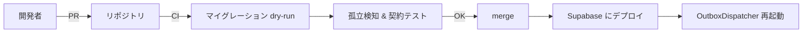

# 06. RLS・Storage・マイグレーションの責務

> Supabase 特有の横断関心事を **ドメイン単位** で整理する。誰が何を触れる／誰が何をデプロイする、を明確にして、ACL が拒絶する境界を壊さないようにする。

## RLS（Row Level Security）

### 役割（ロール）

| 役割 | 誰が使うか | 権限の粒度 |
|------|-----------|-----------|
| `service_role` | Edge Functions, ディスパッチャ | すべてのスキーマに RW。RLS バイパス |
| `authenticated` | ログインユーザー（将来の API クライアント） | 業務操作を担当スキーマに限定 |
| `anon` | 認証前の公開 API（現状なし） | 既定で拒否 |

### スキーマ別ポリシー

| スキーマ | authenticated の権限 | 備考 |
|----------|---------------------|------|
| `hr` | 読: 自組織のスタッフ関連。書: 人事機能のみ | 一般アプリからの書き込み不可 |
| `project` | 読: 自案件。書: 営業・PM | `acl_*` は **読のみ** |
| `staffing_request` | 読: 自部門の依頼。書: 依頼作成者・承認者 | `acl_*` は **読のみ** |
| `work_assignment` | 読: 自担当。書: PS マネージャ | `acl_*` は **読のみ** |

### ACL の共通ポリシー

- ACL テーブルは **`authenticated` に対して `SELECT` のみ許可**。`INSERT`, `UPDATE`, `DELETE` は拒否。
- 書き込みは `service_role`（ディスパッチャ）のみ。
- これにより、誤って画面側から ACL を直接更新する事故を防ぐ。

### サンプル DDL

```sql
-- ACL 表の書き込みをアプリから遮断
ALTER TABLE staffing_request.acl_project ENABLE ROW LEVEL SECURITY;

CREATE POLICY acl_project_select
  ON staffing_request.acl_project
  FOR SELECT
  TO authenticated
  USING (true);

-- INSERT/UPDATE/DELETE には TO authenticated のポリシーを作らない
-- → 既定で拒否。service_role は RLS をバイパスして書ける
```

### `search_path` とスキーマ利用権

- `GRANT USAGE ON SCHEMA staffing_request TO authenticated;` を忘れない（USAGE がないと SELECT もできない）。
- アプリ側で `SET search_path TO work_assignment, public;` のように明示的にスコープを絞ると誤操作を減らせる。

## Storage（添付ファイル）

### 方針

- **バイナリを ACL にコピーしない**。`Project.Attachments`（BYTEA）のような大容量は、**Supabase Storage**（またはオブジェクトストレージ）にオリジナルを置き、**テーブルにはパス（オブジェクトキー）だけ**を保持する。
- ACL に写すのは「パス」か、「URL を再発行するための識別子」のみ。

### バケット設計

| Storage バケット | 所有者 | 書ける人 | 読める人 |
|-----------------|--------|---------|---------|
| `project-attachments` | `project` コンテキスト | 案件担当 | 案件担当 + `service_role` |
| `staffing-order-attachments` | `staffing_request` コンテキスト | 依頼作成者・承認者 | 同左 |

### ACL からの参照

- `acl_project` などの **表示用** にはパスを持たず、必要になった画面が上流スキーマまたは API 経由で取得する（表示頻度が低いため）。
- もし「下流画面で常に添付一覧を出す」要件が出たら、その列のみ ACL に追加する（**列の追加は契約書 [03-acl-contract.md](03-acl-contract.md) を改訂**）。

## マイグレーション責務

### 原則

1. **スキーマのオーナーシップをコンテキスト単位で決める**。1 人または 1 チームが 1 スキーマを所有する。
2. **上流スキーマのマイグレーション（例: `project` に列追加）は、下流 ACL の契約を変える場合、先行で合意**する。
3. **マイグレーションファイルは、スキーマ別にプレフィックスで区別**する。

### ファイル命名（提案）

[autoassign-supabase-cli/migrations/](../../autoassign-supabase-cli/migrations/) の既存慣習に合わせ、タイムスタンプの後にスキーマ名を入れる。

```
20260421120000_hr_init.sql
20260421120100_project_init.sql
20260421120200_project_customer.sql           # 顧客マスタ新設
20260421120300_staffing_request_init.sql
20260421120400_staffing_request_acl.sql       # ACL テーブル
20260421120500_work_assignment_init.sql
20260421120600_work_assignment_acl.sql
20260421120700_outbox_init.sql                # PoC 用
```

### 既存 SQL からの移行

[db/rdb-schema-postgresql.sql](../../db/rdb-schema-postgresql.sql) は現状すべて `public` に作る前提。次の手順で移行する。

1. 既存 DDL をスキーマ別 SQL に分割（生成物は参照用、正はマイグレーション）。
2. 新スキーマ（`hr`, `project`, `staffing_request`, `work_assignment`）を作る。
3. 既存テーブルを `ALTER TABLE ... SET SCHEMA` で移動。
4. ACL テーブル・Outbox・FK ポリシーの変更を追加マイグレーションで適用。
5. `public` には互換ビュー（旧名）を置き、既存クエリが壊れないようにする（任意）。

### CI 上の確認

- マイグレーション適用後、`autoassign-supabase-cli/verify_seed.sql` 相当の整合性チェックを流す。
- ACL の **孤立検知 SQL**（[05-sync-poc.md](05-sync-poc.md) 参照）を CI で実行し、シード直後に 0 件であることを担保する。

## 開発ワークフロー（簡略）



## 未解決（運用で詰める）

- **複数リポジトリに分割した場合のスキーマ所有権**。現状は単一リポジトリなので一旦不要。
- **本番での Edge Function のスケジュール** と **ディスパッチャの排他制御**（1 インスタンスに絞るか、`SELECT ... FOR UPDATE SKIP LOCKED` を使うか）。
- **個人情報の削除 SLA** と、ACL への反映手順（法務要件があれば別ドキュメント化）。
