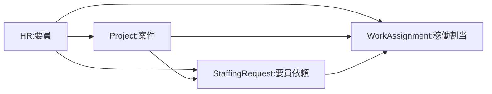

# ACL 妥当性検証と Supabase 実装方針（検証結果）

> 対象: [docs/AutoAssignAgent_Model.hck.json](../AutoAssignAgent_Model.hck.json) の `ACL_*` コレクション  
> 計画: [acl妥当性とsupabase実装_ceddc653.plan.md](../../.cursor/plans/acl妥当性とsupabase実装_ceddc653.plan.md)

このレポートは、データベースやバックエンドに不慣れな読者でも **何が決まり、なぜそう言えるか** を追えるように書いています。詳細は各章の個別ドキュメントにリンクしています。

---

## 1. 結論サマリー

- **ACL（他ドメインのコピーを置く層）は有効** と判断した。ただし「他ドメインに一切依存しない」ではなく、**上流の ID を保ちつつ JOIN（結合）を避ける**という運用上の意味で使う。
- **コンテナが違えば同名でも別テーブル** を採用する（例: `staffing_request.acl_project` と `work_assignment.acl_project`）。
- **物理 FK（外部キー制約）は同じスキーマ内と共有マスタのみ**。ACL から上流実体への FK は張らない。
- **顧客マスタ `project.customer` の新設** が前提。現状の「顧客名で結ぶ」仕組みは壊れやすいため、安定した ID に置き換える。
- 同期は **Outbox パターン（イベント駆動）＋ 日次バッチ救済** を採用。案件名変更の PoC を最優先で実施する。

---

## 2. 用語ミニ辞典

| 用語 | 意味 |
|------|------|
| **データベース (DB)** | 情報を表（テーブル）の形で保存するソフト |
| **PostgreSQL** | オープンソースの関係型データベース。本プロジェクトで採用 |
| **Supabase** | PostgreSQL に認証・ストレージ・Edge Functions を加えた BaaS（バックエンドをまとめて提供するサービス） |
| **スキーマ (schema)** | テーブルを束ねる名前空間。`hr`, `project` のようにコンテキストで分ける |
| **テーブル (table)** | 同じ種類のデータを行と列で保存する単位 |
| **列 (column)** | テーブルの項目（`name`, `period_start` など） |
| **主キー (PK)** | その行を一意に指す列。通常は UUID |
| **外部キー (FK)** | 別テーブルの行を参照する列。DB に整合性を守らせる制約 |
| **UUID** | 衝突しない識別子の形式（`...-...-...` の 16 進文字列） |
| **バックエンド** | ユーザーの画面の裏で動くサーバー側の処理 |
| **API** | アプリ同士が通信するための入口 |
| **トランザクション (Tx)** | 複数の書き込みをまとめて「全部成功か全部失敗」にする仕組み |
| **ACL（腐敗防止層）** | 他ドメインのデータを「このシステム用に写したコピー」として持つ層。呼び方は Anti-Corruption Layer |
| **ドメイン / コンテキスト** | 業務上の区切り。案件・要員・要員依頼・稼働割当など |
| **SoT（Source of Truth）** | その情報の「正」がどこかを指す考え方 |
| **Outbox パターン** | 書き込み Tx と同じ境界で「イベント表」にも記録し、別プロセスで配信する設計 |
| **冪等性 (べきとうせい)** | 同じ操作を何度やっても結果が変わらない性質 |
| **RLS (Row Level Security)** | 行ごとにアクセスを制御する PostgreSQL の機能 |

---

## 3. 三層でわかる本文

### 3.1 アーキテクチャ（全体の組み立て）

業務を 4 つのドメインに分けています。**上から下へデータが流れ**、下流は上流の「コピー（ACL）」だけを持って仕事をします。これにより、上流の都合で下流が壊れにくくなります。

- 矢印は「コピー元 → コピー先」の方向（ACL の流れ）。
- 下流から上流への依存は避けます。
- 案件名やスタッフ名などが変わったら、イベントで下流のコピーを追いかけます（[05-sync-poc.md](05-sync-poc.md)）。

### 3.2 データベース（保存のしかた）

- 4 つの **スキーマ** に分割: `hr` / `project` / `staffing_request` / `work_assignment`。
- 各下流スキーマに **`acl_*` テーブル** を置き、必要な列だけをコピーする。
- **同じ名前でもコンテナ（スキーマ）が違えば別テーブル**: `staffing_request.acl_project` と `work_assignment.acl_project` は、責務も列集合も別物として扱う。
- **外部キーのポリシー**
  - 同じスキーマ内: 張る（整合性を DB に任せる）
  - 共有マスタ（`hr.role`）への参照: 張る
  - ACL から上流への直接参照: **張らない**（境界を越えた依存を物理制約で固めない）
- **顧客の扱い**: 現状の `Project.customer_name`（文字列キー）は表記揺れで壊れるため、`project.customer(id UUID)` を新設し、そちらを正とする。

詳細:

- テーブル割り当て: [01-table-mapping.md](01-table-mapping.md)
- 識別子の方針: [02-identifier-review.md](02-identifier-review.md)
- 列・SoT・更新トリガの契約書: [03-acl-contract.md](03-acl-contract.md)
- スキーマ分割と FK: [04-pg-schema-fk-policy.md](04-pg-schema-fk-policy.md)

### 3.3 バックエンド（動き）

**誰がいつ ACL を書き換えるか** を固定します。

- 画面操作が発生すると、上流スキーマへの更新と同じトランザクションで **Outbox 表**にイベントを 1 行書く。
- バックグラウンドの **ディスパッチャ**が Outbox を見て、下流の ACL を UPSERT（あれば更新、なければ作成）する。
- 失敗しても再試行で追いつき、同じイベントが 2 回来ても壊れない（**冪等性**）。
- 万一の取りこぼしは **日次バッチ**で差分を再投影する。

「ユーザーから見るとどう変わるか」

- 案件名を変えた瞬間、**稼働割当の画面の案件名も 1 分以内に反映**される想定（契約 `< 1 min` 以下）。
- 画面の表示名は少しだけ遅れる可能性があるが、**業務判断に使う期間や金額は即時**に整合する。

詳細:

- 同期 PoC: [05-sync-poc.md](05-sync-poc.md)
- RLS / Storage / マイグレーション: [06-cross-cutting.md](06-cross-cutting.md)

---

## 4. 判断一覧

| # | 項目 | 決定内容 | 理由（Why） | リスク・注意 |
|---|------|----------|-------------|-------------|
| 1 | コンテナ単位の ACL | **同名でも別テーブル** | 列集合・同期規則・ライフサイクルがコンテキストごとに異なり得る | テーブル数が増える。スキーマ名で整理 |
| 2 | 物理 FK | **同一スキーマ内＋共有マスタのみ**。ACL→上流は張らない | 上流スキーマ変更・データ移行に強くなり、境界が物理制約で崩されない | DB レベルでの参照整合性はアプリ＋バッチで担保が必要 |
| 3 | 顧客識別子 | `project.customer(id UUID)` を新設して ID 参照に | 表記揺れ・同名で結合が壊れない | 既存データの移行作業が発生 |
| 4 | 共有マスタ `role` | **ACL を通さず直接参照** | 全コンテキスト共通の汎用コード表 | 将来ドメイン固有ロールが必要になったら再検討 |
| 5 | スタッフ氏名コピー | **表示用のみ**。ACL の `display_name` は検索結合に使わない | 表記変更や個人情報削除に追従しやすい | 一時的に古い名前が表示されうる（契約で許容範囲を明示） |
| 6 | 添付（バイナリ） | **ACL にコピーしない**。Storage にパスだけ | 容量と同期コストを避ける | 下流画面で添付が常時必要になったら再検討 |
| 7 | 同期方式 | **Outbox + 日次バッチ** | 書き込み Tx と同境界で記録でき、疎結合・冪等性を確保しやすい | ディスパッチャの排他制御と監視が必要 |
| 8 | 鮮度 (許容ラグ) | 期間・金額は `< 1 min`、表示名は `< 1 day` | 業務判断と表示で要件が異なる | 日次バッチで救済し、超過時はアラート |
| 9 | RLS | ACL は **SELECT のみ** を `authenticated` に開放。書き込みは `service_role` | 画面から ACL を直接書く事故を防ぐ | Edge Functions の権限管理が必要 |
| 10 | polyglotOnly の ACL | 要員依頼側の `ACL_Project`/`ACL_Staff` は **物理化する** | 明細表示で必須のため、毎回 JOIN を避けたい | 同期の対象テーブルが増える（契約書で管理） |
| 11 | 初回提供範囲 | 案件名変更 → 下流 ACL 追従の PoC を 1 本 | 同期の欠陥は本番直前まで見えづらい | PoC をスキップしないこと |

---

## 5. 未解決・フォローアップ

| 項目 | 内容 | 次のアクション |
|------|------|---------------|
| 顧客マスタの新設 | 既存の `Project.customer_name` を `customer_id` に置き換える移行計画 | データ移行 SQL の下書きと、既存画面の影響範囲調査 |
| 個人情報の削除 SLA | 上流の削除請求を ACL にどう反映するか | 法務要件を確認し、06 に追記 |
| Edge Functions のスケジュール | ディスパッチャの定期起動・排他制御 | Supabase スケジューラ（pg_cron）と `FOR UPDATE SKIP LOCKED` を検証 |
| 稼働割当の項目 | 稼働側 ACL で `work_assignment.acl_customer` を持つべきか | 顧客マスタ新設後、必要性を再評価 |
| 添付の扱い | Storage バケット設計（`project-attachments` 等）と RLS | 別タスクで Storage 構成ドキュメントを作成 |
| 既存 DDL の移行 | [db/rdb-schema-postgresql.sql](../../db/rdb-schema-postgresql.sql) のスキーマ分割 | マイグレーションを段階適用するブランチを切る |

---

## 付録

個別の検証成果物:

1. [01-table-mapping.md](01-table-mapping.md) - ACL テーブル名・スキーマ配置・命名規則
2. [02-identifier-review.md](02-identifier-review.md) - 識別子レビュー（自然キー依存の見直し）
3. [03-acl-contract.md](03-acl-contract.md) - 各 ACL の列・SoT・更新トリガ・許容ラグ
4. [04-pg-schema-fk-policy.md](04-pg-schema-fk-policy.md) - PostgreSQL スキーマ分割と FK ポリシー
5. [05-sync-poc.md](05-sync-poc.md) - 同期 PoC（Outbox + 日次バッチ）
6. [06-cross-cutting.md](06-cross-cutting.md) - RLS / Storage / マイグレーション

### 文体のルール（この章のためのメモ）

- 英語の技術名のあとに括弧で日本語の意味を添える。
- 「〜すべき」より「この検証では〜とした（理由は〜）」と、事実と根拠をセットにする。
- 内部 ID（GUID）や詳細 SQL は個別ドキュメントに回し、この README には載せない。
