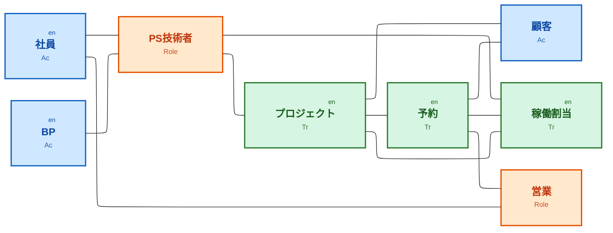

# データモデル接続図（Flowchart）

Acter（Ac）、Transaction（Tr）、Role の3タイプで色分けし、Entity には右上に `en` を表示する。接続はリレーション種別なしの無向リンク。タイプ別のサブグラフは使わず、ELK レンダラで配線を整える。

表示できない場合は、init から `'defaultRenderer': 'elk'` を削除すると dagre に戻る。

## 凡例

| 色 | データタイプ |
|----|----------------|
| 青系 | Acter（Ac） |
| 緑系 | Transaction（Tr） |
| 橙系 | Role |

Entity はノード右上の `en` および Tr/Ac のラベル行で区別する。
