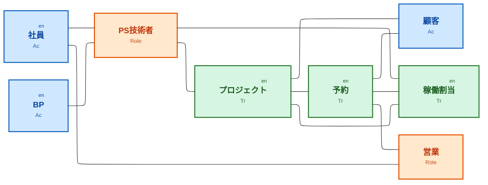
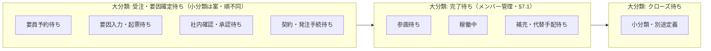
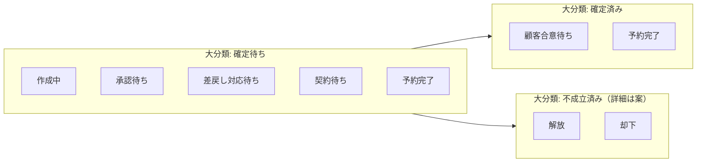
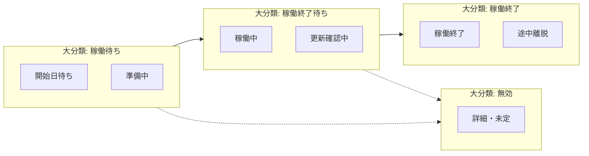
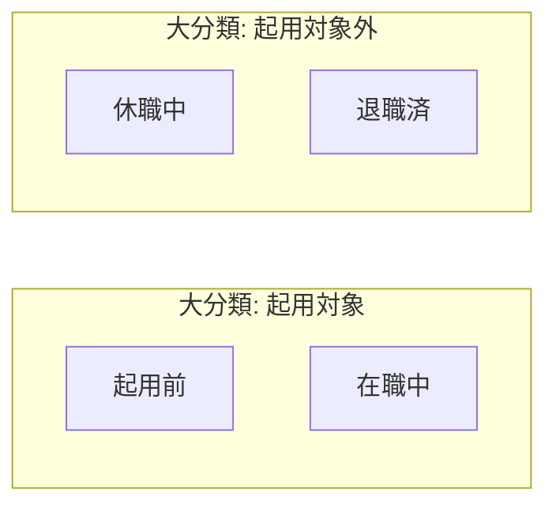

# データモデル接続図（Flowchart）

Acter（Ac）、Transaction（Tr）、Role の3タイプで色分けし、Entity には右上に `en` を表示する。接続はリレーション種別なしの無向リンク。タイプ別のサブグラフは使わず、ELK レンダラで配線を整える。

**予約と稼働割当:** 予約Trは稼働割当と**同種の情報を複数内包**する。稼働割当Trは**後続**として別レコードで持ち、**予約・大分類：確定待ち・小分類：予約完了**に至ったタイミングで内包情報から生成する想定（`docs/reservation-status.md`）。図上の `res --- asn` は、この親子・生成元と後続Trの関係を表す。

表示できない場合は、init から `'defaultRenderer': 'elk'` を削除すると dagre に戻る。

## 凡例

| 色 | データタイプ |
|----|----------------|
| 青系 | Acter（Ac） |
| 緑系 | Transaction（Tr） |
| 橙系 | Role |

Entity はノード右上の `en` および Tr/Ac のラベル行で区別する。

## 各データのステータス（フローチャート）

`project-status.md`、`reservation-status.md`、`work-assignment-status.md`、`employee-status.md` に基づく。以下のフローチャートは各 `*-status.md` にも同一内容で掲載する（本節はデータモデル全体の俯瞰用）。

各図は **subgraph のタイトルが大分類**（一覧・レポートのくくり）、**その内側のノードが詳細**（大分類の中の立て付け）である。`docs` 内のステータスドキュメントでも同じ用語で統一する。詳細が未定のときはプレースホルダを1ノード置く。**大分類どうし**の矢印は本流の目安であり、厳密な必須順序は業務ルールで別途定義する。

顧客・BP・営業・PS技術者（Role）については、本リポジトリにステータス一覧ドキュメントはない（社員のみ `employee-status.md`）。

### プロジェクト（Transaction）

大分類は `project-status.md` に準拠。受注と要因確定は同一帯。**受注・要因確定待ち**の小分類は案（順不同・往復可）。**完了待ち**のメンバー管理小分類は同ドキュメント §7.1。クローズ待ちの小分類は別途定義。

### 予約（Transaction）

申請時点の大分類は必ず「確定待ち」から始まる（ドラフトは小分類**作成中**）。詳細は `reservation-status.md`。**確定待ち・予約完了**で稼働割当生成のトリガとする。

### 稼働割当（Transaction）

本流は「稼働待ち→稼働終了待ち→稼働終了」。大分類に**無効**もあり、本流を経ずに遷移しうる（`work-assignment-status.md`）。各大分類の小分類は同ドキュメント §3.5 に従う。

### 社員（Acter）

すべての社員は、大分類として「起用対象」または「起用対象外」のどちらか一方に必ず属する。人事イベントで大分類・詳細を跨ぐ遷移がありうる（`employee-status.md`）。

