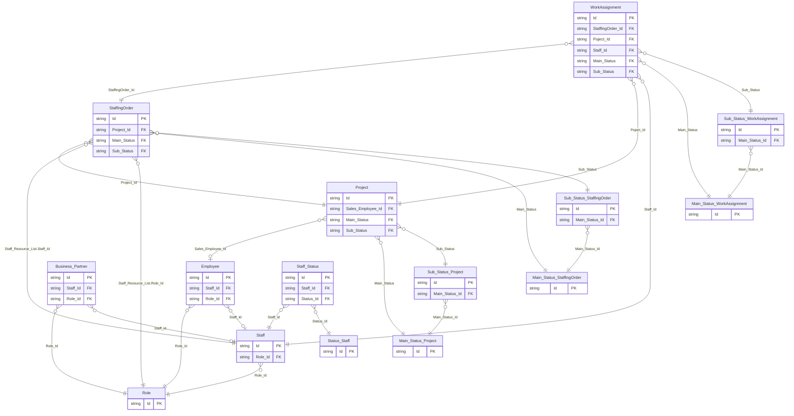
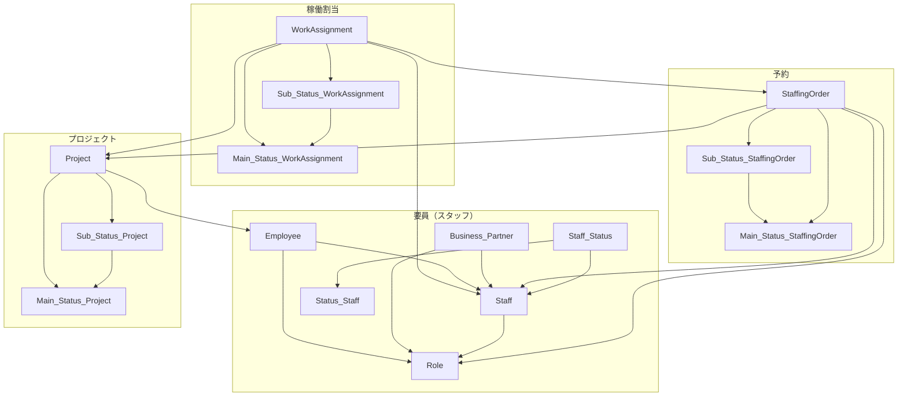

# Hackolade データモデル（Mermaid）

`AutoAssignAgent_Model.hck.json` のコレクション・外部キー関係を Mermaid で表現したもの。

## 1. ER 図（主要エンティティと FK）

`erDiagram` ではハイフンを含む名前を避け、`Staff-Status` は `Staff_Status` としている。`Sub_Status__StaffingOrder` は `Sub_Status_StaffingOrder` と表記。

## 2. ドメイン（バケット）別の俯瞰

Hackolade の `buckets`（要員・予約・プロジェクト・稼働割当）に合わせた配置。エンティティ間の接続は上記 FK と同じ。

## 3. 補足

- `Project`、`StaffingOrder`、`WorkAssignment` などは JSON 定義 `Period` および `Monthly_Allocation` を参照する埋め込み型を持つ。上図ではリレーション線の見やすさのため省略。
- `WorkAssignment.Poject_Id` は Hackolade 上のスペル（`Project` の誤記）のまま。
- `StaffingOrder` の `Staff_Resource_List` 内ネストに対する `Staff` / `Role` への FK は、ER 図では1本の関係として圧縮して記載している。
