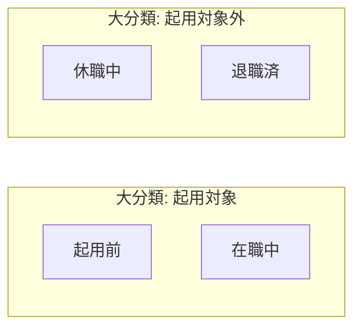

# 社員ステータス

社員（Acter）の**起用可否**を大分類・詳細で定義する。

## 1. 目的

- 一覧・検索で**予約・稼働割当の対象にできるか**を共通言語で区別する。
- **稼働割当の余地**（稼働率の空き・掛け持ち）は、稼働割当・予約から算出する。社員ステータスには持たず、二重管理を避ける。

## 2. データモデル上の前提

- 社員は Acter として扱う（`docs/data-model-flowchart.md`）。

## 3. 大分類

| 内部名   | 表示名     | 説明 |
|----------|------------|------|
| Active   | 起用対象   | 入社前・在職など、起用の候補になりうる側。 |
| Inactive | 起用対象外 | 休職・退職など、現時点で起用しない側。 |

## 4. 詳細

大分類に属する具体区分。

| 大分類   | 内部名（例） | 表示名   | 説明 |
|----------|--------------|----------|------|
| Active   | pre_join     | 起用前   | 入社前、または復職予定。 |
| Active   | employed     | 在職中   | 入社済みで通常勤務。 |
| Inactive | leave        | 休職中   | 休職。 |
| Inactive | retired      | 退職済   | 退職。 |

内部名は実装時に置き換えてよい。復職予定は詳細を「起用前」に含め、日付や備考で補う想定。

## 5. フローチャート（大分類・詳細）

すべての社員は、大分類として「起用対象」または「起用対象外」のどちらか一方に必ず属する。subgraph のタイトルが**大分類**、内側のノードが**詳細**。人事イベントで大分類・詳細を跨ぐ遷移がありうる。同図は `docs/data-model-flowchart.md` にも掲載する。

## 6. 関連ドキュメント

- `docs/data-model-flowchart.md`（社員と Role・稼働割当の関係）
- `docs/work-assignment-status.md`（稼働割当の大分類: 稼働待ち・稼働終了待ち・稼働終了・無効）
- `docs/project-status.md`（プロジェクトの大分類ステータス）
