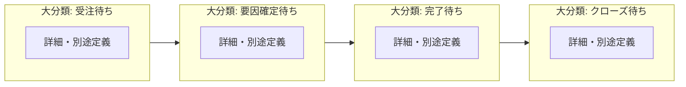

# プロジェクトステータス（大分類・確定）

プロジェクト（Transaction）の**大分類**ステータスを定義する。詳細（具体ステータス）は未確定のため、本書では扱わない。

## 1. 目的

- 一覧・レポート・通知の**粗い分類**を共通言語で固定する。
- 各大分類名が**次に何を待っているか**を示す（「～待ち」形式）。

## 2. データモデル上の前提

- プロジェクトは Transaction（Tr）として扱う（`docs/data-model-flowchart.md`）。
- 本アプリでは**営業が提案段階の案件に対して技術者を予約する**ことが中心である。従来型の「誰かが一括でプロジェクトにアサインする」モデルではない。
- 大分類は上記の利用シーンに合わせ、**予約・要因の確定・実行完了・事務クローズ**の流れで説明できるようにする。

## 3. 大分類（確定）

順序はライフサイクルの目安であり、厳密な必須順序は業務ルールで別途定義する。

| 順 | 表示名 | いま待っているもの（次の扉） |
|----|--------|------------------------------|
| 1 | 受注待ち | 顧客からのコミット（受注・契約など）。 |
| 2 | 要因確定待ち | 単価・体制・期間など**要因**の合意・確定。 |
| 3 | 完了待ち | 成果・稼働の**完了**（納品・期間満了など）。 |
| 4 | クローズ待ち | 請求・記録・引き継ぎなど**終了処理**の完了。 |

### フローチャート（大分類・詳細）

subgraph のタイトルが**大分類**、内側のノードが**詳細**。詳細が未定のときはプレースホルダを1ノード置く。大分類どうしの矢印は本流の目安であり、厳密な必須順序は業務ルールで別途定義する。同図は `docs/data-model-flowchart.md` にも掲載する。

## 4. 各大分類の役割（補足）

### 4.1 受注待ち

- 案件は存在するが、**受注前**の帯。営業による**要員予約**は主にここで行う想定。
- 開始日が未来でもよい（先取りの予約と両立する）。

### 4.2 要因確定待ち

- 見積・価格の差し戻し、継続案件からの**要因引き継ぎ後の確定前**など、**商業条件がロックされていない**間を置く。
- 確定後は「この条件で回す」フェーズ（大分類としては完了待ち側）へ進む。

### 4.3 完了待ち

- 要因はビジネス上確定済み。**現場の実行から完了まで**を表す。
- **欠員・別人への付け替え、複数プロジェクト間のメンバー交換**などは、原則**大分類は完了待ちのまま**とし、予約・稼働割当の変更や詳細（将来定義）で表す。

### 4.4 クローズ待ち

- 実務は終了したが、**帳務・記録・承認**など事務上の〆が残る場合に用いる。
- 〆が不要な運用では、この大分類を使わず**終了扱い**に寄せる設計もありうる（実装・運用で選択）。

## 5. 終了・失注

- **クローズ待ちを経たあと**、システム上は「アーカイブ済み」「参照のみ」など**大分類の外**の表現にするか、詳細で表すかは実装時に決める。
- **失注・中止**を大分類のどこに置くか（受注待ちからの打ち切し、要因確定待ちからの中止など）は、別途フラグや詳細と組み合わせて定義する。

## 6. 詳細について

- 詳細は**本書では確定しない**。必要になったときに、チームや画面ごとに具体ステータスを定義する。
- 命名は大分類と同様、「次の行動が読み取りやすい」ことを優先できる。

## 7. 関連ドキュメント

- `docs/data-model-flowchart.md`（プロジェクトと予約・稼働割当の関係）
- `docs/reservation-status.md`（予約の大分類・詳細）
- `docs/work-assignment-status.md`（稼働割当の大分類: 予定・稼働・終了・無効）
- `docs/employee-status.md`（社員の起用可否ステータス）
