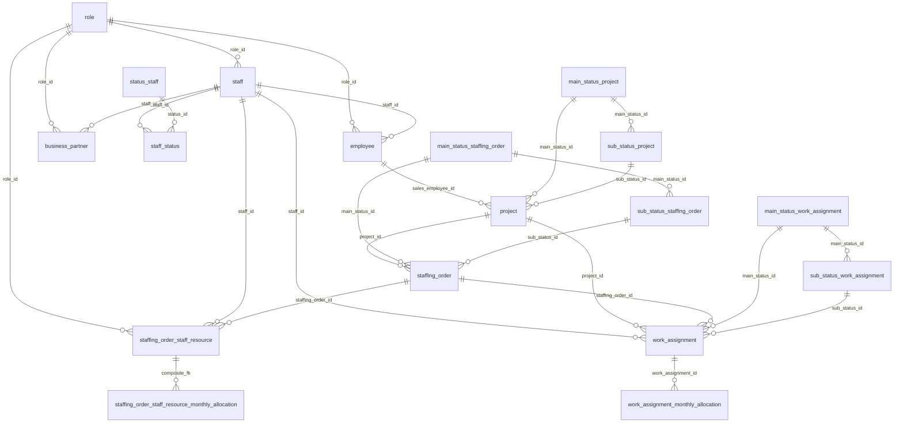
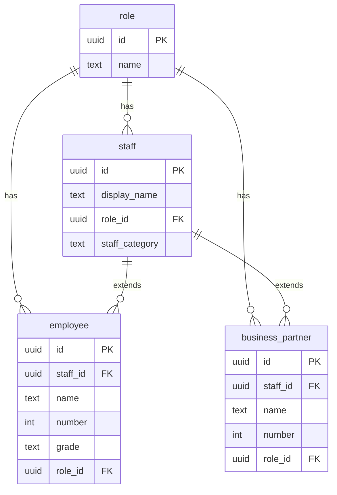
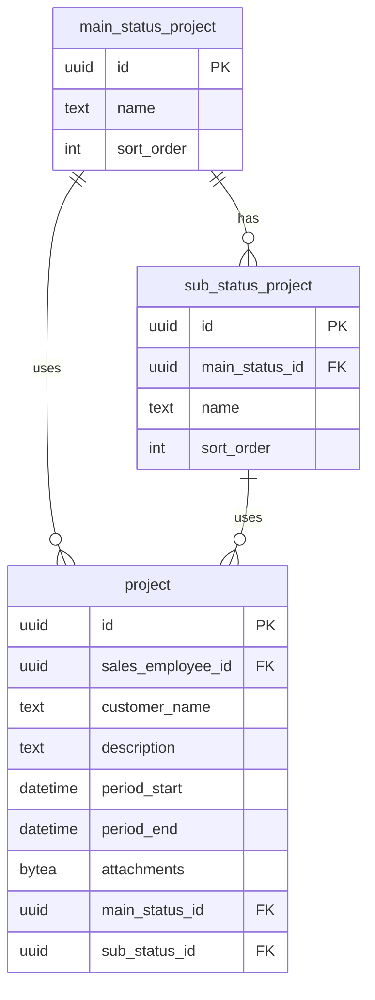
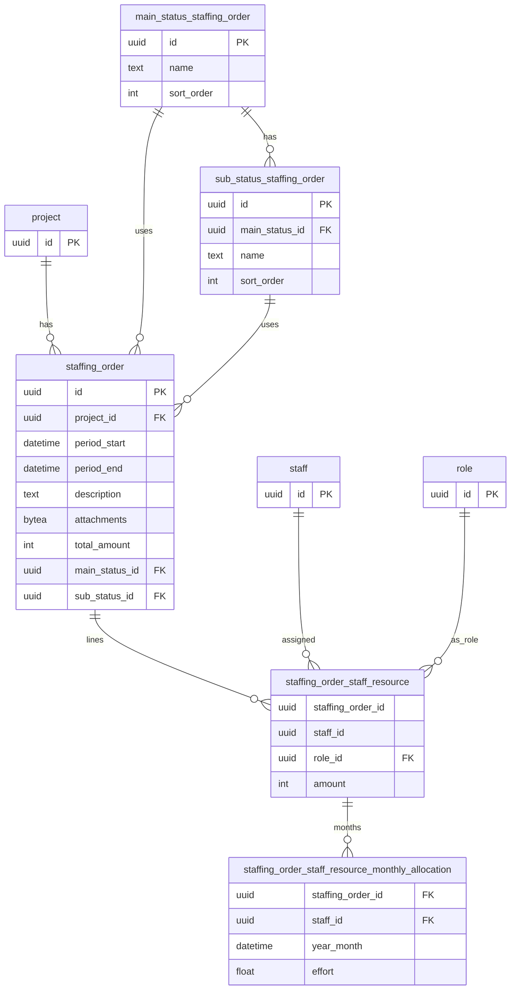
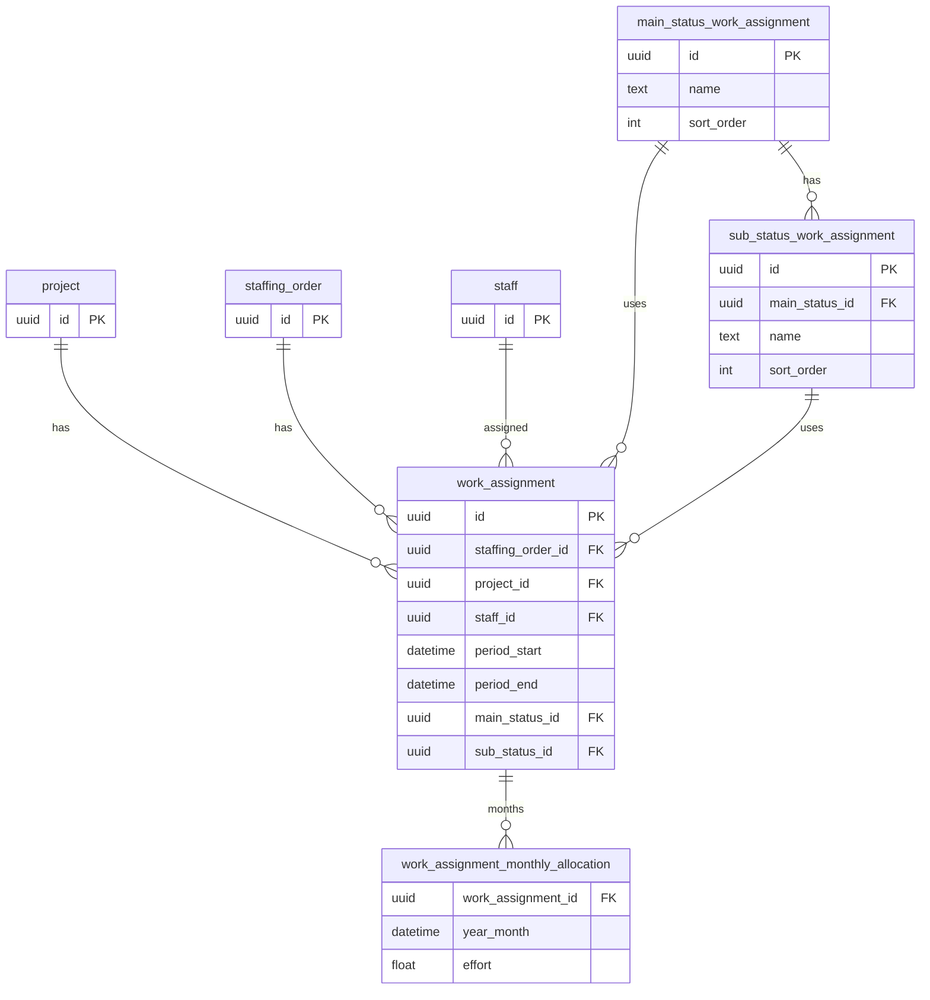
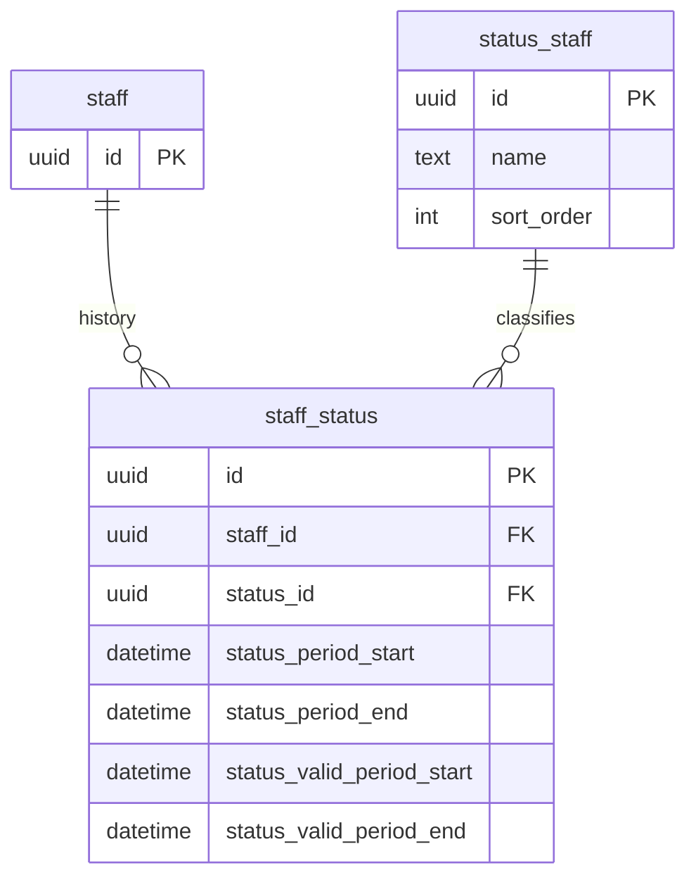

# PostgreSQL スキーマ ER 図（`rdb-schema-postgresql.sql`）

GitHub や VS Code の Mermaid プレビュー、HackMD などで表示できます。

## 全体（テーブルと外部キー）

```mermaid
erDiagram
    role ||--o{ staff : "role_id"
    role ||--o{ employee : "role_id"
    role ||--o{ business_partner : "role_id"
    role ||--o{ staffing_order_staff_resource : "role_id"

    staff ||--o{ employee : "staff_id"
    staff ||--o{ business_partner : "staff_id"
    staff ||--o{ staffing_order_staff_resource : "staff_id"
    staff ||--o{ work_assignment : "staff_id"
    staff ||--o{ staff_status : "staff_id"

    employee ||--o{ project : "sales_employee_id"

    main_status_staffing_order ||--o{ sub_status_staffing_order : "main_status_id"
    main_status_project ||--o{ sub_status_project : "main_status_id"
    main_status_work_assignment ||--o{ sub_status_work_assignment : "main_status_id"

    main_status_project ||--o{ project : "main_status_id"
    sub_status_project ||--o{ project : "sub_status_id"

    project ||--o{ staffing_order : "project_id"
    project ||--o{ work_assignment : "project_id"

    main_status_staffing_order ||--o{ staffing_order : "main_status_id"
    sub_status_staffing_order ||--o{ staffing_order : "sub_status_id"

    staffing_order ||--o{ staffing_order_staff_resource : "staffing_order_id"
    staffing_order ||--o{ work_assignment : "staffing_order_id"

    staffing_order_staff_resource ||--o{ staffing_order_staff_resource_monthly_allocation : "composite_fk"

    main_status_work_assignment ||--o{ work_assignment : "main_status_id"
    sub_status_work_assignment ||--o{ work_assignment : "sub_status_id"

    work_assignment ||--o{ work_assignment_monthly_allocation : "work_assignment_id"

    status_staff ||--o{ staff_status : "status_id"
```

## ドメイン別（主要カラム付き）

```mermaid
erDiagram
    role {
        uuid id PK
        text name
    }
    staff {
        uuid id PK
        text display_name
        uuid role_id FK
        text staff_category
    }
    employee {
        uuid id PK
        uuid staff_id FK
        text name
        int number
        text grade
        uuid role_id FK
    }
    business_partner {
        uuid id PK
        uuid staff_id FK
        text name
        int number
        uuid role_id FK
    }

    role ||--o{ staff : has
    role ||--o{ employee : has
    role ||--o{ business_partner : has
    staff ||--o{ employee : extends
    staff ||--o{ business_partner : extends
```

```mermaid
erDiagram
    main_status_project {
        uuid id PK
        text name
        int sort_order
    }
    sub_status_project {
        uuid id PK
        uuid main_status_id FK
        text name
        int sort_order
    }
    project {
        uuid id PK
        uuid sales_employee_id FK
        text customer_name
        text description
        datetime period_start
        datetime period_end
        bytea attachments
        uuid main_status_id FK
        uuid sub_status_id FK
    }

    main_status_project ||--o{ sub_status_project : has
    main_status_project ||--o{ project : uses
    sub_status_project ||--o{ project : uses
```

```mermaid
erDiagram
    project {
        uuid id PK
    }
    main_status_staffing_order {
        uuid id PK
        text name
        int sort_order
    }
    sub_status_staffing_order {
        uuid id PK
        uuid main_status_id FK
        text name
        int sort_order
    }
    staffing_order {
        uuid id PK
        uuid project_id FK
        datetime period_start
        datetime period_end
        text description
        bytea attachments
        int total_amount
        uuid main_status_id FK
        uuid sub_status_id FK
    }
    staff {
        uuid id PK
    }
    role {
        uuid id PK
    }
    staffing_order_staff_resource {
        uuid staffing_order_id
        uuid staff_id
        uuid role_id FK
        int amount
    }
    staffing_order_staff_resource_monthly_allocation {
        uuid staffing_order_id FK
        uuid staff_id FK
        datetime year_month
        float effort
    }

    project ||--o{ staffing_order : has
    main_status_staffing_order ||--o{ sub_status_staffing_order : has
    main_status_staffing_order ||--o{ staffing_order : uses
    sub_status_staffing_order ||--o{ staffing_order : uses
    staffing_order ||--o{ staffing_order_staff_resource : lines
    staff ||--o{ staffing_order_staff_resource : assigned
    role ||--o{ staffing_order_staff_resource : as_role
    staffing_order_staff_resource ||--o{ staffing_order_staff_resource_monthly_allocation : months
```

```mermaid
erDiagram
    project {
        uuid id PK
    }
    staffing_order {
        uuid id PK
    }
    staff {
        uuid id PK
    }
    main_status_work_assignment {
        uuid id PK
        text name
        int sort_order
    }
    sub_status_work_assignment {
        uuid id PK
        uuid main_status_id FK
        text name
        int sort_order
    }
    work_assignment {
        uuid id PK
        uuid staffing_order_id FK
        uuid project_id FK
        uuid staff_id FK
        datetime period_start
        datetime period_end
        uuid main_status_id FK
        uuid sub_status_id FK
    }
    work_assignment_monthly_allocation {
        uuid work_assignment_id FK
        datetime year_month
        float effort
    }

    project ||--o{ work_assignment : has
    staffing_order ||--o{ work_assignment : has
    staff ||--o{ work_assignment : assigned
    main_status_work_assignment ||--o{ sub_status_work_assignment : has
    main_status_work_assignment ||--o{ work_assignment : uses
    sub_status_work_assignment ||--o{ work_assignment : uses
    work_assignment ||--o{ work_assignment_monthly_allocation : months
```

```mermaid
erDiagram
    staff {
        uuid id PK
    }
    status_staff {
        uuid id PK
        text name
        int sort_order
    }
    staff_status {
        uuid id PK
        uuid staff_id FK
        uuid status_id FK
        datetime status_period_start
        datetime status_period_end
        datetime status_valid_period_start
        datetime status_valid_period_end
    }

    staff ||--o{ staff_status : history
    status_staff ||--o{ staff_status : classifies
```
