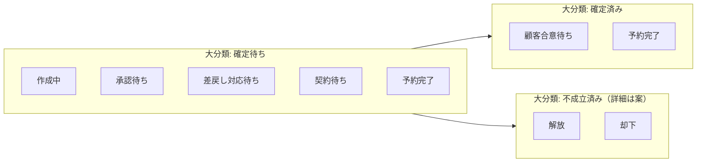

# 予約ステータス

予約（Transaction）のステータスを定義する。大分類は**確定前後と終了**の粗い分類、詳細は**確定待ち・確定済みの内側**（誰の手元か）および**不成立の理由**（解放か却下か）を表す。

## 1. 目的

- 営業が予約を**申請した時点**から、**稼働割当への確定**、**不成立（解放・却下）**までを共通言語で扱う。
- 大分類は一覧・レポート用の**大枠**、詳細は**確定待ち・確定済み**の内訳と、**不成立済み**のときの解放／却下の区別に使う。

## 2. データモデル上の前提

- 予約は Transaction（Tr）として扱う（`docs/data-model-flowchart.md`）。
- **予約と稼働割当は後続トランザクションの関係**とする。予約レコードは、稼働割当と**同種の情報を複数行**（内包）として保持する。
- **大分類が確定待ち**かつ**小分類が予約完了**に至ったタイミングで、その内包情報から**稼働割当（別Tr）**が生成される想定。生成後も予約Trは**確定済み**以降の小分類（顧客合意など）で追跡しうる。
- 営業が予約を**出した段階で申請済み**とみなす。その時点で大分類は**確定待ち**となる（小分類が**作成中**のドラフトの場合も、運用上は確定待ち帯に含める）。
- **キャンセル（リリース）**と**承認却下**は、いずれも**予約が成立しなかった**結果として大分類では同じにまとめ、**詳細**で解放と却下を分ける。
- 確定後の変更は**稼働割当の変更**や**別予約**で表す（プロジェクト大分類の「完了待ちのまま体制変更」と整合させる）。

## 3. 申請時に分かっていること

申請時点で、営業は少なくとも次を把握している前提とする。

- **誰**（どのPS技術者か）
- **どのプロジェクト**に紐づくか
- **いつからいつまで**（期間）

## 4. 承認の要否（ステータスではなくルール）

すべての予約を一人が承認するのではなく、**条件で分岐**する。

- **承認不要（想定）**: 指定の期間に**稼働割当がなく**、**1人月の上限を超えない**など、会社が定めるルールを満たす場合。従来型の「すべてを管理する人」に依存しすぎないようにする。
- **承認要（想定）**: その期間に**すでに埋まっている**、**1人月をオーバーして稼働してもらいたい**、その他ポリシーで例外とする場合。

判定結果は詳細や属性（例: 承認待ちに載せる理由コード）で画面・キューに反映できる。具体ルールは実装・運用で定義する。

## 5. 大分類（確定）

順序はライフサイクルの目安であり、厳密な必須順序は業務ルールで別途定義する。

| 順 | 表示名 | いま待っているもの（次の扉） |
|----|--------|------------------------------|
| 1 | 確定待ち | **社内・契約・承認など、割当生成前の確定処理**。稼働割当Trは未生成（**小分類：予約完了**到達時に内包情報から生成）。 |
| 2 | 確定済み | 割当生成後の**顧客側フォロー**など。小分類は **顧客合意待ち** / **予約完了**（予約Trとしての役目の完了に近い）。 |
| 3 | 不成立済み | **予約が成立しなかった**終了。解放（リリース）と却下（承認拒否）の別は**詳細**で表す。 |

### 5.1 確定待ち

- 申請直後から、**確定済み**または**不成立済み**に進むまでの帯（業務によっては**小分類：予約完了**で一度割当を生成したのち、**確定済み**へ移る）。
- **内訳は詳細**で表す（6.1）。

### 5.2 確定済み

- **稼働割当生成後**、顧客との合意や予約案件の仕舞いを扱う帯。小分類は 6.2。

### 5.3 不成立済み

- **予約ができなかった**パターンを大分類ではひとまとめにする。一覧では「未確定で終わった予約」として同列に扱える。
- **解放**（キャンセル・リリース）と**却下**（承認フロー上の拒否）の区別は**詳細**で持つ（6.3）。
- **解放**: 営業または権限者による取り下げ。承認待ち・差戻し中からも可能にするかは権限設計で決める。
- **却下**: 承認者が採用しないと判断した場合。再チャレンジを新規予約にするかは運用で決める。

## 6. 詳細（確定）

大分類に応じて値の集合が異なる。**次に誰が何をするか**、または**不成立の理由**が読み取れる名前を優先する。

### 6.1 確定待ちの詳細

| 表示名 | いま待っているもの（目安） |
|--------|--------------------------|
| 作成中 | 営業が予約情報を**一時保存**しているドラフト。申請前の下書き。 |
| 承認待ち | ルール上必要な**承認者**の判断。 |
| 差戻し対応待ち | 承認者から**修正依頼**。営業が内容を直し、再申請するまで。 |
| 契約待ち | **BP など社外要員**が絡む場合に、社外契約・条件確定などを待つ窓口。社内のみの枠では通常使わない想定。 |
| 予約完了 | 社内手続・承認・契約が揃い、**割当生成の前提が満たされた**段階。**この小分類への到達（または直後）をトリガ**に、内包情報から**稼働割当Trを生成**する。 |

再提出後は再度**承認待ち**などに戻すなど、状態機械は実装で単純化する。

### 6.2 確定済みの詳細

| 表示名 | いま待っているもの（目安） |
|--------|--------------------------|
| 顧客合意待ち | 稼働割当生成後、**顧客との最終合意・確認**が残っている。 |
| 予約完了 | 顧客面も含め**予約Trとしての役目が完了**に近い。運用でアーカイブや参照のみに寄せてよい。 |

**補足:** 確定待ちにも**予約完了**があり、確定済みにも**予約完了**がある。前者は**割当生成トリガ**、後者は**予約案件全体のクローズ**を指す（同名は画面で接頭語や説明で区別してよい）。

### 6.3 不成立済みの詳細

| 表示名（案） | いま待っているもの（目安） |
|--------------|----------------------------|
| 解放 | 申請の**取り下げ**や**リリース**。枠・キューを手放した。 |
| 却下 | **承認拒否**などにより、申請は採用されなかった。 |

## 7. フローチャート（大分類・詳細）

申請時点の大分類は必ず「確定待ち」から始まる（ドラフトは小分類**作成中**）。subgraph のタイトルが**大分類**、内側のノードが**詳細**。大分類どうしの矢印は本流の目安であり、厳密な必須順序は業務ルールで別途定義する。同図は `docs/data-model-flowchart.md` にも掲載する。

## 8. 代表的な業務シナリオとの対応（参考）

チャットで挙がったケースと、本ステータス設計の対応関係のメモである。個別の業務ルールは別途定義する。

- **先行の予約（将来開始）**: 期間・上限・競合がルール内なら承認不要で**確定待ち**から**予約完了**（割当生成）へ進みうる。競合や超過があれば**承認待ち**。
- **価格・要因の見直し**: 主に**プロジェクト**と見積。未確定の予約は**不成立済み（詳細: 解放）**や差戻しでやり直しも可。確定後は**稼働割当**側の変更が中心。
- **継続顧客から新プロジェクトへ要因を引き継ぐ**: **新規予約**の申請。承認ルールは通常どおり。
- **稼働中の欠員・別人配置**: **稼働割当**の更新が本体。別人を新たに押さえる場合は**新規予約**の申請。
- **同時期の複数プロジェクト間でメンバー交換**: **稼働割当**の更新が中心。必要なら複数予約をまとめた承認などは将来拡張。

## 9. 関連ドキュメント

- `docs/data-model-flowchart.md`（プロジェクト・予約・稼働割当の関係）
- `docs/work-assignment-status.md`（稼働割当の大分類: 稼働待ち・稼働終了待ち・稼働終了・無効）
- `docs/project-status.md`（プロジェクト大分類。受注・要因確定待ち・完了待ち・クローズ待ちとの役割分担）
- `docs/employee-status.md`（社員の起用可否ステータス）
