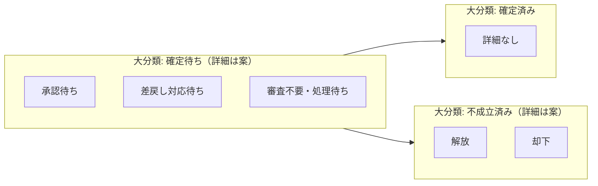

# 予約ステータス

予約（Transaction）のステータスを定義する。大分類は**確定前後と終了**の粗い分類、詳細は**確定待ちの内側**（誰の手元か）および**不成立の理由**（解放か却下か）を表す。

## 1. 目的

- 営業が予約を**申請した時点**から、**稼働割当への確定**、**不成立（解放・却下）**までを共通言語で扱う。
- 大分類は一覧・レポート用の**大枠**、詳細は**確定待ち**の内訳と、**不成立済み**のときの解放／却下の区別に使う。

## 2. データモデル上の前提

- 予約は Transaction（Tr）として扱う（`docs/data-model-flowchart.md`）。
- 営業が予約を**出した段階で申請済み**とみなす。その時点で大分類は**確定待ち**となる。
- **確定**すると、対応する**稼働割当（Tr）**へ移る。業務上アクティブなコミットは確定後は稼働割当側が中心になる想定。
- **キャンセル（リリース）**と**承認却下**は、いずれも**予約が成立しなかった**結果として大分類では同じにまとめ、**詳細**で解放と却下を分ける。
- 確定後の変更は**稼働割当の変更**や**別予約**で表す（プロジェクト大分類の「完了待ちのまま体制変更」と整合させる）。

## 3. 申請時に分かっていること

申請時点で、営業は少なくとも次を把握している前提とする。

- **誰**（どのPS技術者か）
- **どのプロジェクト**に紐づくか
- **いつからいつまで**（期間）

## 4. 承認の要否（ステータスではなくルール）

すべての予約を一人が承認するのではなく、**条件で分岐**する。

- **承認不要（想定）**: 指定の期間に**稼働割当がなく**、**1人月の上限を超えない**など、会社が定めるルールを満たす場合。従来型の「すべてを管理する人」に依存しすぎないようにする。
- **承認要（想定）**: その期間に**すでに埋まっている**、**1人月をオーバーして稼働してもらいたい**、その他ポリシーで例外とする場合。

判定結果は詳細や属性（例: 承認待ちに載せる理由コード）で画面・キューに反映できる。具体ルールは実装・運用で定義する。

## 5. 大分類（確定）

順序はライフサイクルの目安であり、厳密な必須順序は業務ルールで別途定義する。

| 順 | 表示名 | いま待っているもの（次の扉） |
|----|--------|------------------------------|
| 1 | 確定待ち | **ビジネス上の確定**（承認・処理・差戻し対応など）。稼働割当未生成。 |
| 2 | 確定済み | 稼働割当へ反映済み。この予約Trとしての役目は完了に近い。 |
| 3 | 不成立済み | **予約が成立しなかった**終了。解放（リリース）と却下（承認拒否）の別は**詳細**で表す。 |

### 5.1 確定待ち

- 申請直後から、**確定済み**または**不成立済み**に進むまでの帯。
- **内訳は詳細**で表す（6.1）。

### 5.2 確定済み

- システム的には**稼働割当の生成または更新**とセットで扱うとよい。

### 5.3 不成立済み

- **予約ができなかった**パターンを大分類ではひとまとめにする。一覧では「未確定で終わった予約」として同列に扱える。
- **解放**（キャンセル・リリース）と**却下**（承認フロー上の拒否）の区別は**詳細**で持つ（6.2）。
- **解放**: 営業または権限者による取り下げ。承認待ち・差戻し中からも可能にするかは権限設計で決める。
- **却下**: 承認者が採用しないと判断した場合。再チャレンジを新規予約にするかは運用で決める。

## 6. 詳細（案）

大分類に応じて値の集合が異なる。**次に誰が何をするか**、または**不成立の理由**が読み取れる名前を優先する。

### 6.1 確定待ちの詳細

| 表示名（案） | いま待っているもの（目安） |
|--------------|----------------------------|
| 承認待ち | ルール上必要な**承認者**の判断。 |
| 差戻し対応待ち | 承認者から**修正依頼**。営業が内容を直し、再申請するまで。 |
| 審査不要・処理待ち | 承認は不要だが、**稼働割当生成**など非同期・バッチの完了待ち。同期処理なら短く省略してよい。 |

再提出後は再度**承認待ち**や**審査不要・処理待ち**に戻すなど、状態機械は実装で単純化する。

承認不要の場合、**確定待ち**の詳細を**審査不要・処理待ち**にしてから**確定済み**へ進めるか、運用で詳細を省略して**確定待ち**から直接**確定済み**へ進めるかは実装選択とする。

### 6.2 不成立済みの詳細

| 表示名（案） | いま待っているもの（目安） |
|--------------|----------------------------|
| 解放 | 申請の**取り下げ**や**リリース**。枠・キューを手放した。 |
| 却下 | **承認拒否**などにより、申請は採用されなかった。 |

## 7. フローチャート（大分類・詳細）

申請時点の大分類は必ず「確定待ち」から始まる。subgraph のタイトルが**大分類**、内側のノードが**詳細**（確定待ち・不成立済みの詳細は案）。大分類どうしの矢印は本流の目安であり、厳密な必須順序は業務ルールで別途定義する。同図は `docs/data-model-flowchart.md` にも掲載する。

## 8. 代表的な業務シナリオとの対応（参考）

チャットで挙がったケースと、本ステータス設計の対応関係のメモである。個別の業務ルールは別途定義する。

- **先行の予約（将来開始）**: 期間・上限・競合がルール内なら承認不要で**確定待ち**から**確定済み**へ進みうる。競合や超過があれば**承認待ち**。
- **価格・要因の見直し**: 主に**プロジェクト**と見積。未確定の予約は**不成立済み（詳細: 解放）**や差戻しでやり直しも可。確定後は**稼働割当**側の変更が中心。
- **継続顧客から新プロジェクトへ要因を引き継ぐ**: **新規予約**の申請。承認ルールは通常どおり。
- **稼働中の欠員・別人配置**: **確定済み**後は**稼働割当**の更新が本体。別人を新たに押さえる場合は**新規予約**の申請。
- **同時期の複数プロジェクト間でメンバー交換**: **稼働割当**の更新が中心。必要なら複数予約をまとめた承認などは将来拡張。

## 9. 関連ドキュメント

- `docs/data-model-flowchart.md`（プロジェクト・予約・稼働割当の関係）
- `docs/work-assignment-status.md`（稼働割当の大分類: 予定・稼働・終了・無効）
- `docs/project-status.md`（プロジェクト大分類。要因・完了待ちとの役割分担）
- `docs/employee-status.md`（社員の起用可否ステータス）
