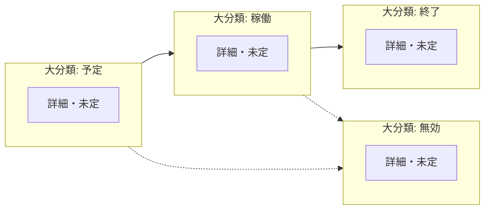

# 稼働割当ステータス

稼働割当（Transaction）のステータスを定義する。大分類は**予定・稼働・終了・無効**の4区分とする。プロジェクトや予約の大分類が「～待ち」形式であるのに対し、稼働割当は**ライフサイクル上の段階**をそのまま示す語を用いる。

## 1. 目的

- 予約確定後の**稼働コミット**（誰が・いつからいつまで・どのプロジェクトか）を一覧・レポートで共通言語で扱う。
- 「次に誰が何を待つか」よりも、**いまその枠がどの段階か**（まだ始まっていない／動いている／片付いた／無かったことにする）を直感的に示す。

## 2. データモデル上の前提

- 稼働割当は Transaction（Tr）として扱う（`docs/data-model-flowchart.md`）。
- 営業の**予約が確定**すると、対応する稼働割当が**生成または更新**される（`docs/reservation-status.md`）。業務上アクティブなコミットは、確定後は稼働割当側が中心になる想定。
- 確定後の体制変更・欠員・別人配置などは、原則**稼働割当の更新**や**別予約**で表す（プロジェクト大分類は「完了待ちのまま」など、`docs/project-status.md` と整合）。

## 3. 大分類（確定）

順序はライフサイクルの目安であり、厳密な必須順序は業務ルールで別途定義する。

| 順 | 表示名 | 意味（目安） |
|----|--------|----------------|
| 1 | 予定 | 期間の**開始前**。枠はあるが、まだ稼働していない。 |
| 2 | 稼働 | **稼働中**の帯。勤怠・承認・引き継ぎなど**事務上の締め**が残る場合も、大分類ではここに含め、細部は詳細や別属性で表す。 |
| 3 | 終了 | その稼働割当としての**役目は完了**。参照・履歴が主。 |
| 4 | 無効 | **打ち切し・取消・誤登録**など。成立しなかった、または巻き戻したコミット。 |

### 3.1 予定

- 先行予約により、プロジェクトがまだ**受注・要因確定待ち**の段階でも存在しうる。
- 開始日時点で**稼働**へ進む。申請時点で開始日が過去に近い場合は、生成直後から**稼働**とするなど、実装で単純化してよい。

### 3.2 稼働

- プロジェクトの**完了待ち**と期間が重なりやすいが、**1対1ではない**（プロジェクトが続いていても、個別の稼働割当は先に**終了**しうる）。
- 欠員・代理・付け替えの内訳は**詳細**（将来定義）や関連レコードで表す。

### 3.3 終了

- 期間満了・成果完了・合意による早期終了など、ビジネス上**正常に閉じた**結果。
- 事務上の締めを**終了**に入れるか**稼働**に含め続けるかは運用で選択可能。本書の大分類では、締めも含め**稼働**に載せ、すべて済んだら**終了**とする想定をデフォルトとする。

### 3.4 無効

- プロジェクトの**失注・中止**に伴う整理、予約の**不成立**後の巻き戻し、誤操作の取消など。
- 予約側の**不成立済み**（解放・却下）とセットで発生しうる。

### 3.5 フローチャート（大分類・詳細）

本流は「予定→稼働→終了」。大分類に**無効**もあり、本流を経ずに遷移しうる。subgraph のタイトルが**大分類**、内側のノードが**詳細**（本書では詳細は未確定のためプレースホルダ）。点線は無効への遷移の例。同図は `docs/data-model-flowchart.md` にも掲載する。

## 4. 予約・プロジェクトとの対応（要約）

| 観点 | 内容 |
|------|------|
| 予約 | **確定済み**で予約Trの役目はほぼ終わり。稼働割当は通常**予定**または**稼働**から始まる。 |
| プロジェクト | 大分類は**受注・要因確定待ち**・完了待ち・クローズ待ちの粗い帯。稼働割当の**予定・稼働・終了**と期間で対応するが、必ずしも同じタイミングで進まない。 |
| 変更 | 確定後の価格・要因は主にプロジェクトと見積。**人と期間のコミット**の変更は稼働割当の更新や新規予約が本体。 |

## 5. 詳細について

- 詳細は**本書では確定しない**。欠員補填・代理稼働・期間変更承認待ちなど、必要になったときに定義する。
- 命名は画面やキューで**次の行動が読み取りやすい**ことを優先できる（予約ステータスの詳細と同趣旨）。

## 6. 関連ドキュメント

- `docs/data-model-flowchart.md`（プロジェクト・予約・稼働割当の関係）
- `docs/reservation-status.md`（予約の確定と稼働割当への反映）
- `docs/project-status.md`（プロジェクト大分類と体制変更の扱い）
- `docs/employee-status.md`（社員の起用可否）
